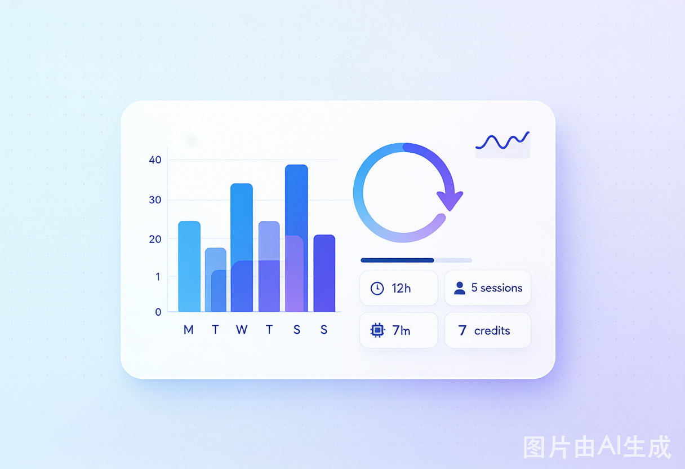

# weekly-review-skill



通用周度复盘 skill。

**设计原则：固化底座，不固化成品。**

- **固化（vendored 成模板）**：数据读取、一页看板、项目分布、根因三类归因、动作台账、长会话对齐、自动化概览。
- **不固化（留给使用者）**：每周具体项目名、人工标注的问题与改进项。
- **约束**：新写的每周复盘必须 import 同一套底座，风格锁死，内容随变。

## 能力

1. **CLI**：直接生成 Markdown 复盘报告或原始 JSON。
2. **MCP server**：通过 stdio JSON-RPC 暴露 `run_weekly_review` 工具，任何支持 MCP 的 agent 都能调用。
3. **WorkBuddy SKILL**：在 WorkBuddy 中安装 `skills/workbuddy/SKILL.md` 后可直接对话触发。

## 安装

```bash
# 1. 克隆仓库
git clone https://github.com/testman2025/weekly-review-skill.git
cd weekly-review-skill

# 2. 安装（推荐用 uv / pip）
pip install -e .

# 3. 验证 CLI
weekly-review --help
```

## 使用

### CLI

```bash
# 默认生成上周报告
weekly-review -o weekly-report.md

# 指定周期并附加人工标注
weekly-review --start 2026-07-13 --end 2026-07-19 --notes notes.json -o report.md
```

`notes.json` 示例：

```json
{
  "problems": [
    {
      "description": "1/3 指令仍是动词+无交付物",
      "category": "【用户】",
      "root_cause": "提问习惯",
      "suggestion": "反问训练机制已写入记忆，持续执行"
    }
  ],
  "actions": {
    "done": [
      {
        "action": "公众号文章去同质化重写",
        "trigger": "用户反馈",
        "change": "第2篇锚点改为多工作区≠重复投入"
      }
    ],
    "observing": [
      {
        "action": "反问训练机制上线",
        "criteria": "下周复盘模糊指令占比是否明显下降"
      }
    ],
    "pending": [
      {
        "suggestion": "TubePilot 跨夜 idle 下周继续对齐",
        "priority": "中",
        "deadline": "2026-07-26",
        "status": "待开始"
      }
    ]
  }
}
```

### MCP server

在支持 MCP 的 agent 中配置：

```json
{
  "mcpServers": {
    "weekly-review": {
      "command": "weekly-review-mcp"
    }
  }
}
```

然后调用工具 `run_weekly_review`。

### WorkBuddy

复制 `skills/workbuddy/SKILL.md` 到 `~/.workbuddy/skills/weekly-review/SKILL.md`。

或直接把本仓库作为 WorkBuddy skill 目录安装。

## 底座结构

生成的报告固定包含以下章节：

1. 一页看板（wall-clock、真实活跃时长、Credit 消耗、会话数、跨周/跨夜会话）
2. 分项目分析（按 cwd 自动聚合）
3. 问题清单 + 根因三类归因（思路/记忆/流程）
4. 本周动作台账（当场已改 / 待观察 / 待落实）
5. 待对齐开放会话（>48h 跨周、跨夜 idle）
6. 自动化运行概览

## 数据源

默认读取 `~/.workbuddy/workbuddy.db`（WorkBuddy 的 SQLite 数据库），包含 `sessions`、`session_usage`、`automations`、`automation_runs` 等表。

可通过 `--db-path` 指定其他路径。

## 许可证

MIT
