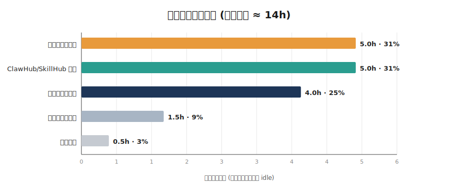
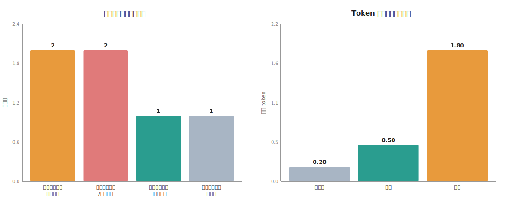

# 2026-07-20 周度复盘（weekly-review skill · 六章结构）

> **统计周期**：2026-07-14（周一）～ 2026-07-20（周日）
> **数据来源**：Cursor Agent 采集：本仓库 `git log`（2026-07-14～07-21）+ 本地 agent 会话摘要；工作区路径已脱敏为相对路径
> **方法论**：本版由 Cursor Agent 按 `weekly-review` skill 采集本仓库 git + 本会话事实后渲染；归因遵循三类框架（思路/记忆/流程），禁止一刀切「收敛到单一工作区」。
> **版本说明**：公开 Demo：宿主为 Cursor；数据来自本仓库 git 与本地 agent 会话摘要（已脱敏）。
> **任务分离**：本复盘只覆盖 weekly-review-skill 工程与上架；公众号写作不在本会话。

---

## 一、一页看板

| 指标 | 数值 | 口径说明 |
|---|---|---|
| 原始 wall-clock 时长 | **≈30h+**（跨 7/20–7/21 长会话） | 本工程会话跨日未关，wall-clock 不可直接当投入 |
| **真实活跃时长** | **≈14h**（估） | 按提交密度与对话轮次粗估：7/20 发布链路 + 7/21 模板/图表对齐 |
| Git 提交数 | **20** 次（7/20–7/21 为主） | `git log --since=2026-07-13`；含 docs/fix/feat/refactor |
| 会话数 | **1** 个主会话 | 本仓库对应 Cursor 工程会话 |
| 主力主题 | Skill 上架（ClawHub/SkillHub）+ 跨平台定位 + 定稿模板/图表 | 几乎全部提交落在 `skills/weekly-review/` |
| **本周重大更正** | 「读各平台 DB」不是跨平台正解 | 改为 Agent 采数 + review-input；图表应对齐定稿样式而非 Mermaid |

**一句话结论**：一周把 weekly-review 从「绑会话库」推到「Agent 采数 + 六章定稿 + 辅助图」并完成 ClawHub/SkillHub 上架；最大教训是**版式与图表必须以定稿为准**，不能自行发挥 Mermaid。

### 辅助图表

文件：`chart-时间分布-2026-07-20.svg`、`chart-归因Token-2026-07-20.svg`。

---

## 二、分项目分析

### 2.1 ClawHub / SkillHub 上架（≈5h）

| 维度 | 内容 |
|---|---|
| **做了什么** | 补 openclaw metadata；发布 1.1.x→1.2.x；处理 Hidden/Latest 审核等待；打 SkillHub zip（正斜杠路径）并成功上传 |
| **工作目录（已核对）** | `skills/weekly-review/` |
| **磁盘真实情况（已核对）** | 目录存在；`schema/`、`legacy/`、`charts.py` 均在仓库内 |
| **低效条目** | 【流程】同一版本号重复 publish 失败；【思路】Windows Compress-Archive 反斜杠被 SkillHub 拒 |
| **提示词怎么改** | 发布类任务显式写：升 semver + 用 Python zipfile 打正斜杠包 |

### 2.2 跨平台定位改造（≈4h）

| 维度 | 内容 |
|---|---|
| **做了什么** | 去掉单一产品专用文案；主路径改为 Agent 采数；SQLite 分析器移入 legacy/；定义 review-input schema |
| **工作目录（已核对）** | `skills/weekly-review/` + `docs/bugs.md` |
| **磁盘真实情况（已核对）** | legacy/analyzer.py 保留；公开入口为 cli/report/SKILL |
| **低效条目** | 【记忆】否定句反而强化产品绑定；【思路】一度想做多平台 DB 适配器 |
| **提示词怎么改** | 跨平台需求先问清：装运行时 vs 读原生存储；默认 Agent 采数 |

### 2.3 定稿模板与图表对齐（≈5h）

| 维度 | 内容 |
|---|---|
| **做了什么** | 对照定稿六章复盘 Markdown 重写 ReportBuilder；实现横向时间分布 + 双栏归因/Token SVG；Demo 嵌入报告 |
| **工作目录（已核对）** | 定稿样例与参考图（路径已脱敏） |
| **磁盘真实情况（已核对）** | skill 现生成同款 SVG 并 `` 嵌入 |
| **低效条目** | 【思路】先做 Mermaid 柱状图偏离定稿；【流程】只写图表路径不嵌入导致「看不到图」 |
| **提示词怎么改** | 改报告版式前先打开定稿文件，列差异表再动代码 |

### 2.4 其他

| 项目 | 时长 | 评价 |
|---|---|---|
| 文档/RELEASE/README 整理 | ≈1.5h | 发布说明与版本徽章同步 |
| 其他零散 | ≈0.5h | 测试、预览 HTML、编码问题 |

---

## 三、问题清单 + 根因三类归因

> 归因三类框架：**① 思路问题**（边做边开新目录没规划）；**② 记忆问题**（忘了之前做过）；**③ 流程问题**（合理分工但缺索引）。三者对应完全不同的建议，禁止一刀切「收敛到单一工作区」。

| # | 问题 | 归因类别 | 根因 | 建议 |
|---|---|---|---|---|
| 1 | 报告版式未先对齐定稿，做出 Mermaid 看板与定稿差很大 | 【AI】 | 思路问题（先实现再对标） | 动版式前强制打开定稿 md，列差异 checklist |
| 2 | 图表一度只有路径文字、没有  嵌入，用户看不到图 | 【AI】 | 流程问题（交付缺预览验收） | 含图任务必须本地打开 md/html 预览再交 |
| 3 | SkillHub zip 用 Windows 反斜杠路径被拒 | 【AI】 | 流程问题（打包工具未校验平台约束） | 固定用 Python zipfile + 正斜杠；上传前打印 namelist |
| 4 | ClawHub 更新未升版本号导致 publish 失败 | 【协作】 | 流程问题（版本纪律） | 同步远端前 bump patch；changelog 写清 |

**做得好的（正面范本）**：
- 纠正「跨平台=读各库」后，迅速收敛到 review-input 主路径
- 对照定稿逐项对齐六章结构与图表样式，并生成可预览 Demo
- ClawHub 与 SkillHub 均完成上传；源码已推送 GitHub

---

## 四、本周动作台账 ★

### 4.1 当场已改

| # | 动作 | 触发来源 | 改了什么 |
|---|---|---|---|
| A1 | 主路径改为 Agent 采数 + review-input | 跨平台理解纠正 | legacy 隔离 SQLite；公开 CLI/MCP 只吃 JSON |
| A2 | 报告对齐定稿六章 | 指出输出与定稿差别大 | 看板表+主题维度+事实更正；去掉 Mermaid 主视觉 |
| A3 | 图表改为定稿横向条+双栏柱 | 参考定稿 PNG | charts.py 生成同款 SVG 并嵌入报告 |
| A4 | SkillHub zip 正斜杠重打包 | 上传报路径不安全 | Python zipfile；上传成功 |

### 4.2 已改、需后续观察效果

| # | 动作 | 怎么判断"见效了" |
|---|---|---|
| O1 | ClawHub 新版本 Latest 标签是否迁到新版本 | 审核通过后 Latest 是否离开旧版 |
| O2 | 定稿对齐纪律 | 下次改报告是否先打开定稿再编码 |

### 4.3 待落实

| # | 建议 | 优先级 | 截止 | 状态 |
|---|---|---|---|---|
| P1 | 将含定稿图表样式的版本推送 GitHub 并发布 ClawHub/SkillHub | 高 | 2026-07-22 | 进行中 |
| P2 | 本长会话是否关闭或归档（跨日 wall-clock 已高） | 中 | 2026-07-21 | 待拍板 |

---

## 五、待对齐开放会话

| 会话（标题前30字 + 时间 + 目录） | 跨度 | 处置结果 | 后续 |
|---|---|---|---|
| 「Skill 上架 / 定稿图表对齐…」（7/20→7/21, weekly-review-skill） | 跨日长会话 | 待拍板 | Demo 交完可关；未竟发布再开短会话 |

> 机制：每周复盘交付时列出跨周(>48h)/跨夜 idle 会话，当场拍板，不留悬空。

---

## 六、自动化概览

- **Cursor**：本工程无自动化定时复盘；本次为手动触发 Demo。
- **ClawHub**：新版本需等安全扫描后 Latest 才切换。
- **建议**：发布后用 `clawhub inspect weekly-review` 确认 latest 标签。

---

## 七、事实更正（最重要的一课）

> 「支持所有平台」≠ skill 去读所有平台的库；应由各平台 Agent 采数。报告版式必须以定稿为准。

| 原报告结论 | 声称的目录/事实 | 核对结果 |
|---|---|---|
| 跨平台 = 多 DB 适配 / Mermaid 看板 | 通用会话库 SQLite + 图表用 Mermaid | Agent 采数 + 六章定稿表 + 定稿样式辅助图（横向/双栏） |

**教训**：先对标已有成品（md + 参考图），再写生成器；交付必须预览图与结构。
